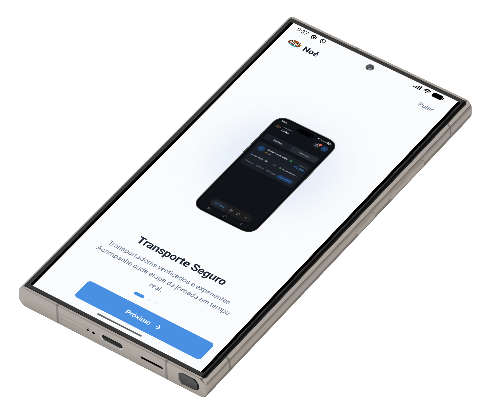
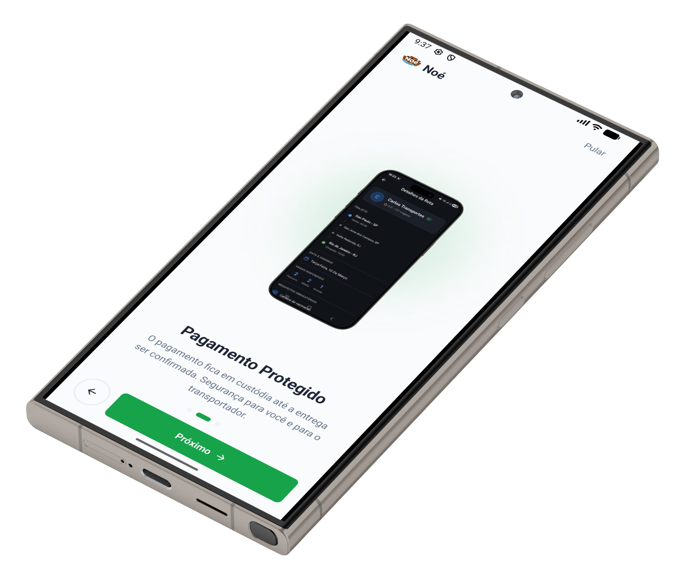
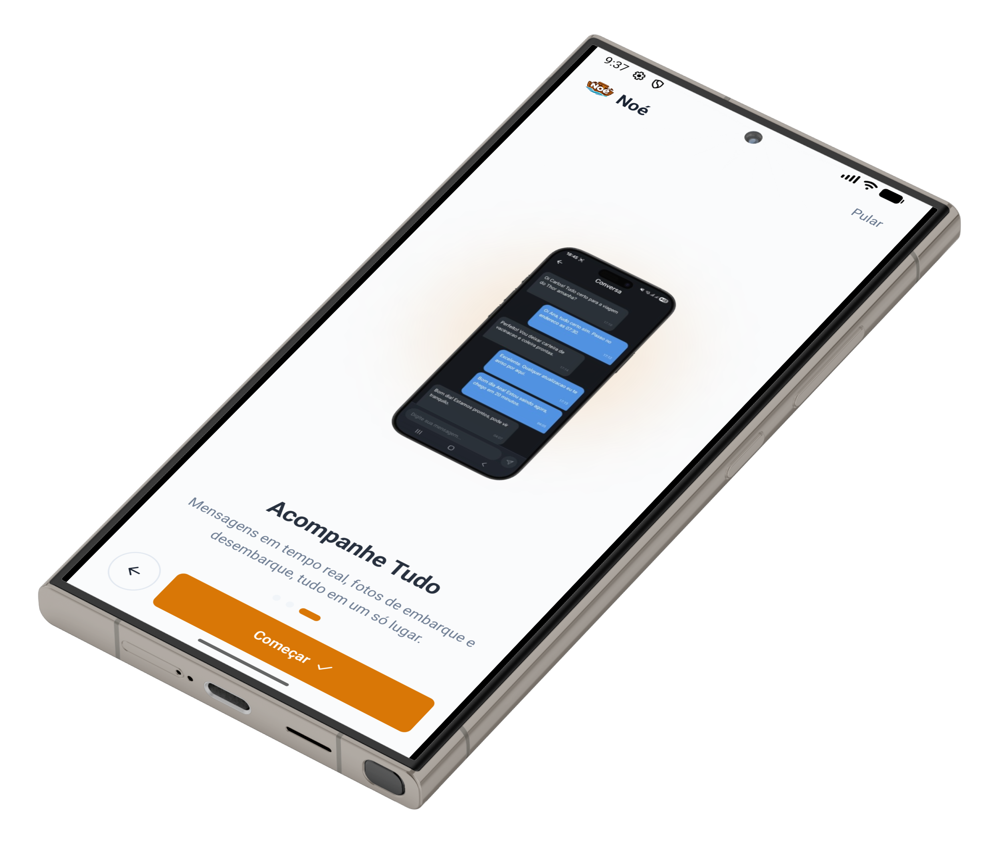
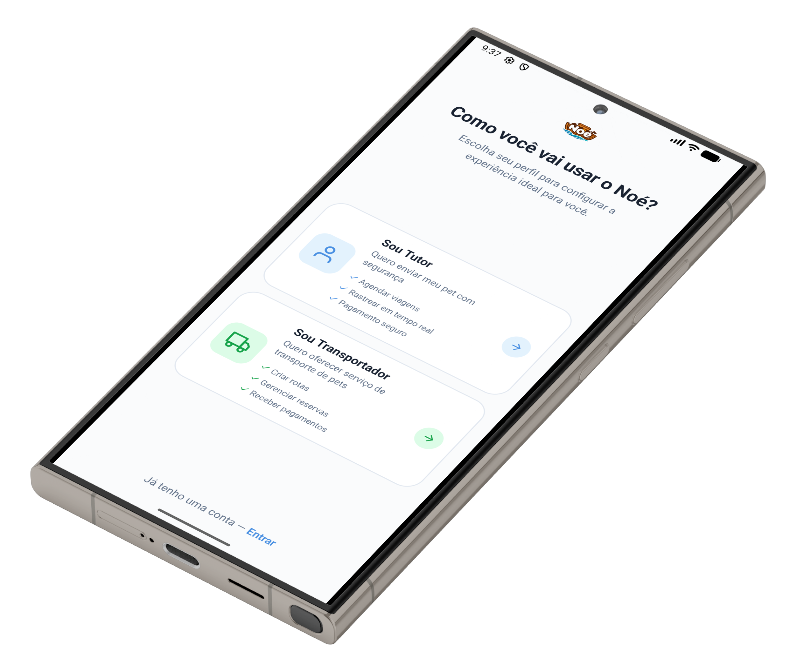
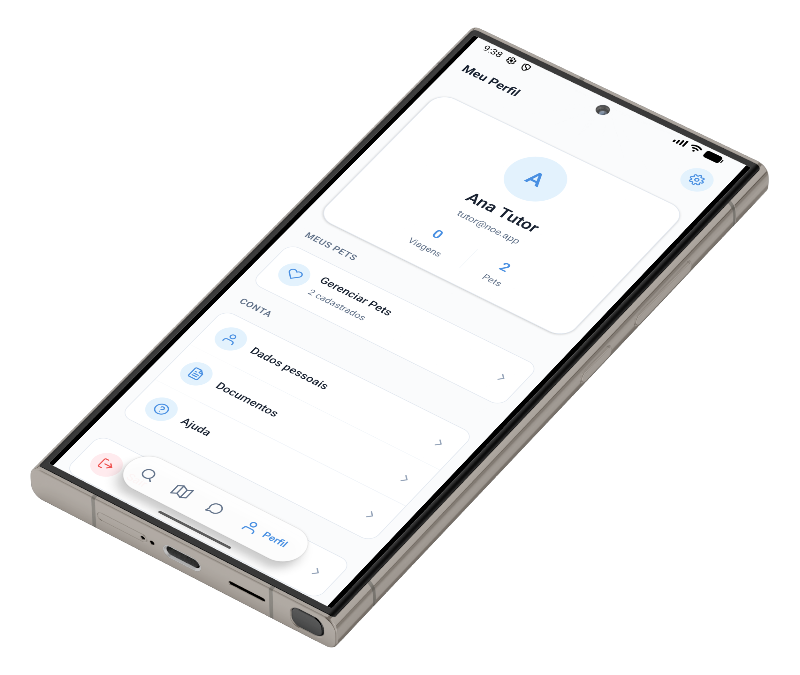
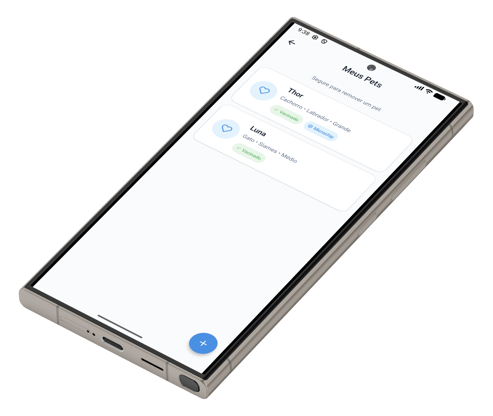
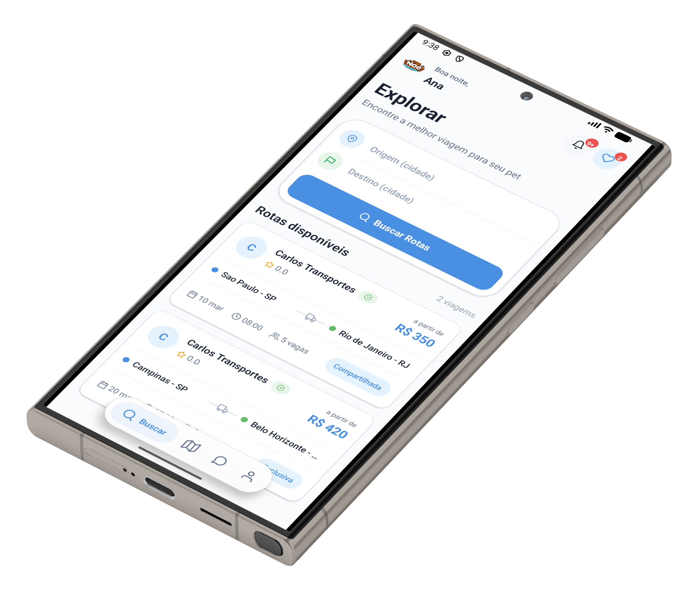
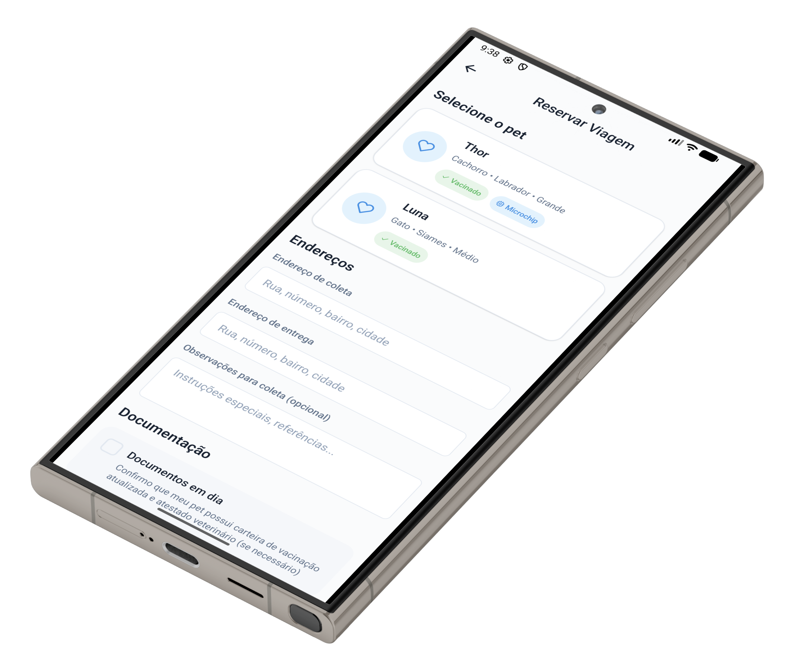
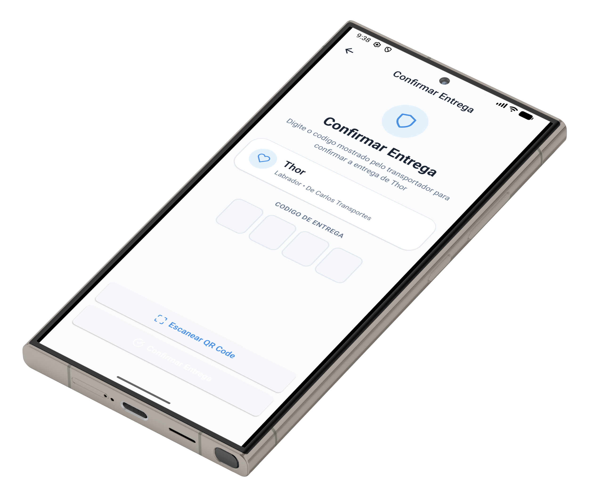

# Noé — Plataforma de Transporte de Pets

> **Tipo:** Plataforma marketplace mobile-first (iOS & Android)
> **Status:** Em desenvolvimento ativo — MVP com funcionalidades completas
> **Stack:** React Native (Expo) · Node.js · Express · PostgreSQL · Prisma · TypeScript · Socket.IO · Firebase

---

## 1. Visão Geral do Projeto

**Noé** é uma plataforma marketplace desenvolvida para conectar **tutores de pets** com **transportadores profissionais** para o transporte seguro, documentado e rastreável de animais entre cidades.

A plataforma opera como um marketplace bilateral estruturado: transportadores publicam rotas com horários e preços; tutores buscam, reservam e acompanham a viagem do seu animal do momento da coleta até a entrega — tudo dentro de uma experiência mobile única e coesa.

O sistema gerencia o ciclo completo do serviço — descoberta, reserva, pagamento, comunicação em tempo real, entrega segura com confirmação e avaliação pós-viagem — substituindo os fluxos informais e fragmentados que dominam atualmente esse mercado.

---

## Screenshots

### Onboarding

| Transporte Seguro | Pagamento Protegido | Acompanhe Tudo |
|:---:|:---:|:---:|
|  |  |  |

### Autenticação e Perfil

| Seleção de Perfil | Meu Perfil | Meus Pets |
|:---:|:---:|:---:|
|  |  |  |

### Fluxo do Tutor

| Explorar Rotas | Reservar Viagem | Confirmar Entrega |
|:---:|:---:|:---:|
|  |  |  |

---

## 2. Contexto de Negócio

### O Problema

O transporte de pets no Brasil é amplamente desestruturado e operacionalmente caótico. Apesar da demanda consistente — impulsionada por mudanças de cidade, viagens e deslocamentos veterinários — o principal método de coordenação ainda são **grupos informais no WhatsApp**.

Isso gera problemas recorrentes para todos os lados:

| Parte | Dores |
|---|---|
| **Tutores (donos de pets)** | Nenhuma visibilidade do serviço, nenhuma verificação dos prestadores, nenhuma proteção financeira, nenhuma confirmação formal de entrega |
| **Transportadores** | Nenhum canal profissional para divulgar serviços, pagamentos informais com risco de fraude, sem mecanismo de resolução de disputas |
| **O Mercado** | Sem responsabilização, sem dados, sem infraestrutura de confiança |

Antes do Noé, um tutor contratando transporte para seu pet não tinha como:
- Verificar as credenciais ou o veículo do transportador
- Confirmar que o animal foi recolhido pela pessoa certa
- Acompanhar o trajeto em tempo real
- Registrar uma reclamação formal em caso de falha na entrega

### Público-Alvo

- **Tutores:** Donos de pets que precisam de transporte organizado e confiável para cães, gatos e outros animais — muitas vezes entre cidades ou estados
- **Transportadores:** Operadores autônomos e pequenas empresas de logística que buscam um canal profissional para expandir sua base de clientes verificados

---

## 3. Arquitetura da Solução

O Noé é construído como um **sistema modular cliente-servidor** com separação clara entre o frontend mobile, a API backend e a camada de comunicação em tempo real.

### Arquitetura de Alto Nível

```
┌─────────────────────────────────────────┐
│       Aplicativo React Native (Expo)    │
│  TanStack Query · React Navigation v7   │
│  React Native Reanimated · Socket.IO    │
└────────────────┬────────────────────────┘
                 │ HTTPS REST + WebSocket
┌────────────────▼────────────────────────┐
│         Servidor de API Express 5       │
│  Arquitetura em camadas (Controller →   │
│  Service → Repository)                  │
│  JWT Auth · Validação Zod · Sentry      │
└────────────────┬────────────────────────┘
                 │ Prisma ORM
┌────────────────▼────────────────────────┐
│         Banco de Dados PostgreSQL       │
│  Schema relacional: Usuários, Rotas,    │
│  Reservas, Pagamentos, Mensagens,       │
│  Avaliações                             │
└─────────────────────────────────────────┘
```

### Stack Tecnológico

| Camada | Tecnologia |
|---|---|
| **Cliente Mobile** | React Native 0.81 · Expo SDK 54 · TypeScript |
| **Navegação** | React Navigation v7 (native stack + bottom tabs) |
| **Gerenciamento de Estado** | TanStack Query (estado servidor) · React Context (estado global) |
| **Backend** | Node.js · Express 5 · TypeScript |
| **Banco de Dados** | PostgreSQL · Prisma ORM |
| **Tempo Real** | Socket.IO (mensagens e atualizações de status bidirecionais) |
| **Notificações Push** | Firebase Cloud Messaging (FCM) via Firebase Admin SDK |
| **Autenticação** | JWT (JSON Web Tokens) · bcrypt para hash de senhas |
| **Validação** | Zod (cliente e servidor — abordagem de schema compartilhado) |
| **Monitoramento** | Sentry (rastreamento de erros e profiling de performance) |
| **Mapas** | React Native Maps (visualização de rotas e rastreamento ao vivo) |
| **Animações** | React Native Reanimated · React Native Skia |

### Estilo de Arquitetura

O backend segue uma **arquitetura estritamente em camadas**:

- **Controllers** tratam as requisições HTTP e delegam às services
- **Services** encapsulam a lógica de negócio e orquestram os repositories
- **Repositories** abstraem todo o acesso ao banco de dados via Prisma

Esse padrão garante testabilidade, separação clara de responsabilidades e uma base de código que escala conforme as funcionalidades crescem.

O cliente é organizado por **perfil de usuário** (Tutor vs. Transportador), com árvores de navegação resolvidas em tempo de execução com base no perfil do usuário autenticado.

---

## 4. Principais Funcionalidades

### Para Tutores (Donos de Pets)
- **Busca e descoberta de rotas** — filtragem por origem, destino, data e porte do pet
- **Perfis verificados de transportadores** — consulte avaliações, histórico de viagens e badges de credencial antes de reservar
- **Fluxo de reserva simplificado** — seleção do pet, endereços de coleta/entrega, upload de documentos e instruções especiais em um fluxo guiado
- **Pagamento com proteção via escrow** — o valor fica retido até a confirmação da entrega bem-sucedida
- **Rastreamento em tempo real** — mapa ao vivo com a localização do transportador durante o trajeto
- **Confirmação segura de entrega** — códigos QR únicos para coleta e entrega, prevenindo fraudes de identidade
- **Mensagens no aplicativo** — chat direto com o transportador antes e durante a viagem
- **Avaliações pós-viagem** — sistema estruturado de notas e comentários

### Para Transportadores
- **Publicação de rotas** — formulário estruturado para definir trajetos, horários, capacidade por porte, preços e política de cancelamento
- **Gestão de reservas** — aceitar ou recusar solicitações com todos os detalhes do pet e do tutor
- **Fluxo de trabalho orientado por status** — ações guiadas: Confirmado → Coletando → Em Trânsito → Entregue
- **Códigos de entrega via QR** — geração e compartilhamento de códigos únicos para a entrega segura
- **Dashboard de viagem ativa** — mapa em tela cheia com rota atual, localização em tempo real e próxima parada
- **Gestão de ganhos e pagamentos** — cadastro de conta bancária e histórico de transações
- **Verificação e conformidade** — fluxo estruturado de upload de documentos: CNH, documento do veículo e seguro de transporte

### Para Toda a Plataforma
- **Notificações push** via Firebase para atualizações de status em tempo real
- **Suporte multilíngue** (Português como idioma padrão)
- **Sistema de temas claro/escuro** responsivo em todas as telas
- **Onboarding animado** com carrossel apresentando as propostas de valor da plataforma

---

## 5. Desafios Técnicos e Soluções

### Desafio 1 — Entrega Física Segura Sem Hardware Adicional
**Problema:** Confirmar que o transportador correto coletou o pet correto, no endereço correto, sem nenhum dispositivo físico adicional.

**Solução:** Um sistema de confirmação em duplo código foi projetado inteiramente em software. Cada reserva gera dois códigos alfanuméricos únicos — um para a coleta (`COL-XXXX`) e outro para a entrega (`DEL-XXXX`). O transportador apresenta um QR code (ou código em texto); o tutor lê ou digita o código manualmente. A validação no servidor controla a transição de status da reserva. Nenhuma das partes consegue avançar no fluxo sem a proximidade física, fornecendo prova mútua da entrega.

### Desafio 2 — Navegação por Perfil em Escala
**Problema:** Tutores e Transportadores possuem estruturas de navegação, abas e fluxos de tela completamente diferentes — mas compartilham autenticação, mensagens e infraestrutura de perfil.

**Solução:** A navegação é resolvida dinamicamente na raiz do aplicativo com base no perfil do usuário autenticado. Telas compartilhadas (Chat, Perfil, Avaliações, Configurações) são organizadas em um namespace comum, enquanto as abas específicas por perfil são montadas em navigators independentes. Isso mantém a lógica de navegação limpa sem duplicação de componentes.

### Desafio 3 — Sincronização de Estado em Tempo Real
**Problema:** Mudanças de status de uma reserva (ex: transportador marca "Em Trânsito") precisam ser refletidas imediatamente na tela do tutor, sem polling.

**Solução:** Socket.IO fornece um canal bidirecional persistente entre cliente e servidor. Mudanças de estado das reservas emitem eventos direcionados para as salas de conversa e reserva correspondentes. O cache do TanStack Query é invalidado nos eventos de socket para manter o estado da UI consistente com o servidor sem polling manual.

### Desafio 4 — Infraestrutura de Confiança em um Marketplace Bilateral
**Problema:** Donos de pets precisam de fortes sinais de confiança antes de confiar um estranho com seu animal; construir essa confiança de forma programática é um desafio de design e engenharia.

**Solução:** A plataforma expõe "provas visíveis de segurança" em cada etapa: badges de verificação para transportadores credenciados, fluxos de upload de documentos com estados de revisão, uploads estruturados de fotos durante o trajeto, status do escrow exibido de forma transparente, e um sistema de avaliação bidirecional após cada viagem concluída. A confiança é incorporada ao design como um princípio de primeira classe, não como um complemento.

### Considerações de Performance e Escalabilidade
- **Atualizações otimistas da UI** via TanStack Query para minimizar a latência percebida
- **Integração com Sentry** para rastreamento de erros no servidor e relatório de crashes no frontend
- **Migrations do Prisma** para versionamento do schema e deploys sem downtime
- **Helmet.js** para headers de segurança HTTP; CORS configurado por ambiente
- **Credenciais por ambiente** (Firebase, banco de dados, segredos JWT) gerenciadas via `.env`, sem segredos no controle de versão

---

## 6. Resultados e Impacto

O Noé entrega melhorias estruturais concretas em relação ao mercado informal atual:

| Dimensão | Antes do Noé | Com o Noé |
|---|---|---|
| **Reserva** | Negociação informal via WhatsApp | Fluxo de reserva estruturado e auditável |
| **Segurança financeira** | Transferências diretas sem mecanismo de disputa | Escrow retido até confirmação da entrega |
| **Responsabilidade do transportador** | Anônimo, sem verificação | Documentado, avaliado e com badge de verificação |
| **Confirmação de entrega** | Nenhum processo formal | Sistema de duplo QR code com confirmação validada pelo servidor |
| **Visibilidade da viagem** | Sem atualizações, a não ser que o tutor pergunte | Rastreamento em mapa ao vivo + notificações push |
| **Resolução de disputas** | Nenhum mecanismo | Histórico de status com timestamps + evidências fotográficas |

**Impacto qualitativo:**
- Elimina a fricção de coordenação e a negociação informal do processo de reserva
- Cria responsabilização verificável para transportadores, reduzindo a assimetria de informação
- Fornece aos tutores documentação e trilha de auditoria completa de cada viagem
- Permite que transportadores construam uma reputação profissional e portátil através de avaliações e histórico de viagens
- Posiciona o serviço como um produto B2C regulado e capaz de parcerias comerciais com clínicas veterinárias, criadores e pet shops

---

## 7. Aviso de Confidencialidade

> O código-fonte deste projeto é **proprietário e confidencial**, desenvolvido sob contrato comercial. O repositório é privado e não está disponível para consulta pública.
>
> Este README é disponibilizado exclusivamente para fins de portfólio e avaliação profissional.
>
> Caso tenha interesse em compreender a implementação técnica com maior profundidade — incluindo decisões de arquitetura, modelagem do banco de dados, estrutura da API ou implementações específicas de funcionalidades — estou disponível para discutir em uma **reunião privada ou entrevista técnica**.
>
> **Para agendar uma conversa:** entre em contato diretamente pelos dados de contato disponíveis no meu portfólio.

---

*Noé — Construindo confiança, uma viagem segura de cada vez.*
